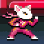

# Super Bunny Strikes Back: Webxdc Port

Take Kitty on a quest to find Bunny lost!
Journey through dark forests and snowy meadows,
pass through a great waterfall to finally reach the steppes and confront the Lion King!
Clear the game to unlock Super Bunny and then hop with him at increased difficulty!

## Getting started

- Drop the `super-bunny.xdc` from the [release assets](https://github.com/DeltaZen/super-bunny/releases)
  to any webxdc-enabled messenger as Delta Chat or Cheogram
- Or try out an [online demo](https://deltazen.github.io/super-bunny/)

## Build

- make sure, [`jsmin`](https://www.crockford.com/jsmin.html) is installed (eg. via packet manager)
- run `./create-xdc.sh` and share the created `super-bunny.xdc` to any chat!

---

This is a Webxdc port of the [Super Bunny Strikes Back](https://github.com/foumart/JS.13kGames.2019_SuperBunny) game.
The game has no music originally and was
enhanced by the incredible sound engine [ZzFXM](https://github.com/keithclark/ZzFXM).
